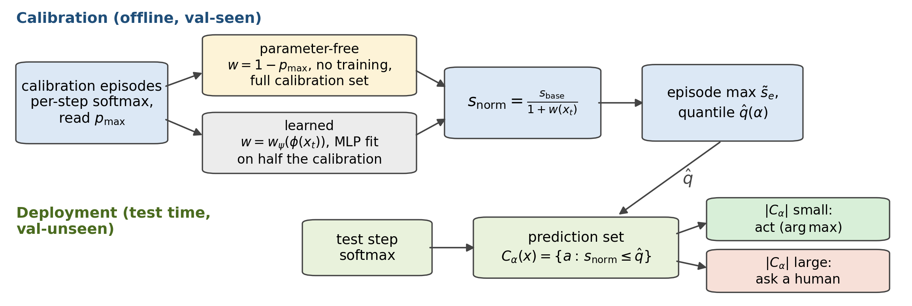
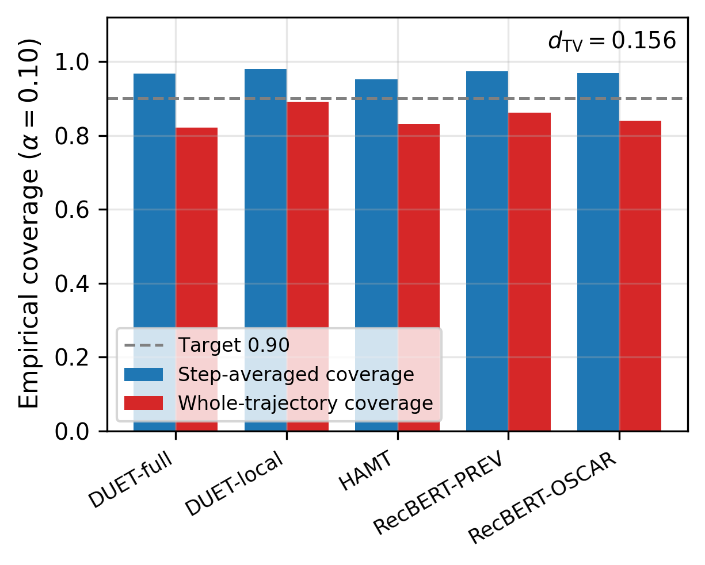
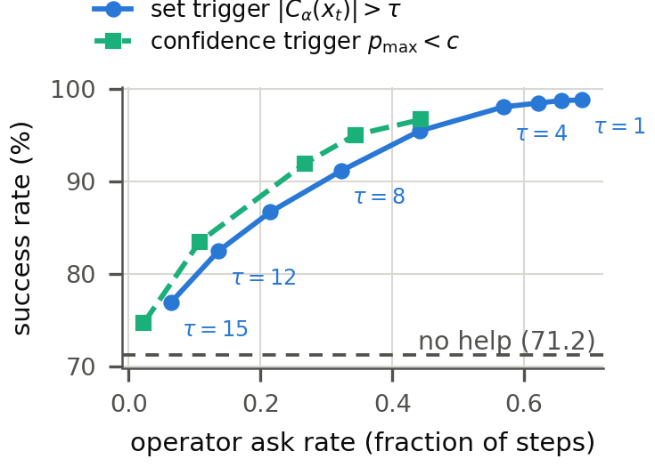
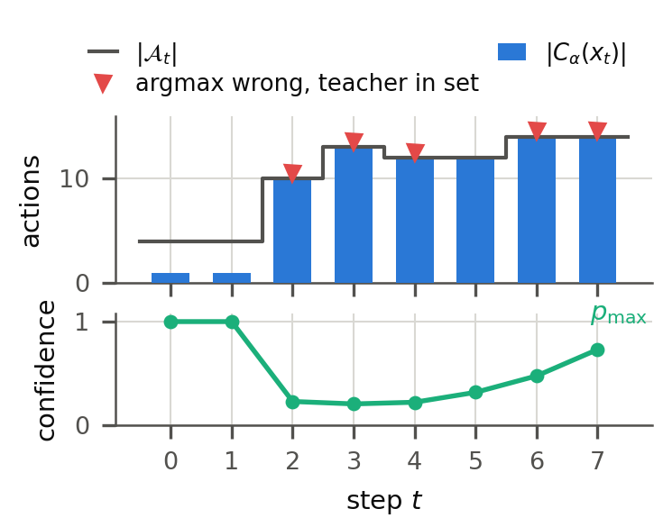

# Parameter-Free Conformal Prediction for Vision-and-Language Navigation

Distribution-free, finite-sample uncertainty guarantees for
vision-and-language navigation (VLN) agents — and a calibrated recipe for
knowing when the agent should stop and ask for help.

<p align="center">
  
</p>

**TL;DR.** A well-trained VLN policy that misreads an instruction commits to
a confidently wrong turn with no internal sign of trouble. Conformal
prediction (CP) should provide the missing safeguard — a calibrated action
set that contains the correct action with probability at least
$1-\alpha$ — but we show that standard CP scores *break* on navigation:
policies are so overconfident that scores concentrate near zero, the
calibrated threshold stops responding to $\alpha$, and prediction sets
collapse to uninformative singletons. We fix this with a **parameter-free
normalisation** — divide any base score by one plus the policy's residual
confidence — and **episode-level calibration**, and prove finite-sample
*simultaneous* coverage over whole trajectories from a single assumption
(exchangeable episodes). No training, no tuning, no extra forward passes.

**Highlights**

- **Works across five backbones** (DUET full/local, HAMT, Recurrent
  VLN-BERT with OSCAR and PREVALENT initialisations), each reproduced to
  within one point of its published success rate: step-averaged coverage
  clears its target in all 45 backbone × score × level cells, and in all
  135 cells of a denser nine-level sweep.
- **Thresholds transfer**: a threshold calibrated on one backbone holds
  coverage within 0.013 of target on every other backbone (20 cross
  pairs), across a 16.4-point success-rate spread.
- **Generalises beyond R2R**: the same guarantee carries to REVERIE
  navigation, unchanged.
- **Closes the loop**: asking a (simulated) operator only at steps the
  prediction set flags lifts success from **71% to 91% at a 32% ask
  rate** on DUET.
- **Fully reproducible**: one entry point, seeded rollouts, a sanity gate
  on every run, unit tests, and a `verify` command that re-asserts every
  load-bearing number of the paper against the committed results
  (currently **21/21 checks pass**).

---

## Contents

- [The problem](#the-problem)
- [The method](#the-method)
- [Results](#results)
- [Repository layout](#repository-layout)
- [Getting started](#getting-started)
- [Running](#running)
- [Reproducibility and verification](#reproducibility-and-verification)
- [Extending this work](#extending-this-work)
- [Paper](#paper)
- [Citation](#citation)
- [Acknowledgements](#acknowledgements)

---

## The problem

Split conformal prediction calibrates a threshold $\hat q$ on held-out
scores so that test-time prediction sets
$C_\alpha(x) = \{a : s(x,a) \le \hat q\}$ cover the correct action with
probability $1-\alpha$. On VLN policies this fails twice:

1. **Score collapse.** Well-trained policies put $p_{\max}$ near 1 on
   almost every step, so base scores (THR/APS/RAPS) concentrate near zero.
   The calibrated quantile saturates, stops responding to $\alpha$, and the
   sets collapse to singletons that just repeat the argmax — base APS and
   RAPS sit at $\hat q = 0$ from $\alpha = 0.30$ onward.
2. **Dependent steps.** Steps of one trajectory are strongly dependent, so
   pooling them as if exchangeable voids the guarantee. The natural
   exchangeable unit in VLN is the *episode*, not the step.

<p align="center">
  
</p>

The figure above also shows the honest caveat: *whole-trajectory* coverage
drops below target under the seen→unseen scene shift (calibration scenes
and test scenes are disjoint buildings), and we measure exactly how far the
exchangeability premise fails ($d_{\mathrm{TV}} = 0.156$ between the two
score laws) rather than hiding it.

## The method

One score family unifies everything in this repo. Any base conformal score
is divided by one plus a non-negative *weight* — the policy's residual
confidence:

$$
s_w(x_t, a) \;=\; \frac{s_{\text{base}}(x_t, a)}{1 + w(x_t)},
\qquad w(x_t) \ge 0 .
$$

Calibration then takes the **per-episode maximum** of $s_w$ over teacher
actions and the corrected split-conformal quantile of those episode
maxima — which is what turns per-step coverage into *simultaneous* coverage
over the whole trajectory, with exchangeable episodes as the only
assumption.

The headline member is **parameter-free**: $w(x_t) = 1 - p_{\max}(x_t)$,
i.e. divide the score by $2 - p_{\max}$. Zero training, zero
hyperparameters, works zero-shot on any policy that exposes a softmax. The
full family implemented in [`cp_core/weights.py`](cp_core/weights.py):

| Member | Weight $w(x_t)$ | Trained? | Calibration data | Role |
|---|---|---|---|---|
| `w0` | $0$ | no | full split | unnormalised baseline (ablation) |
| `pf` | $1 - p_{\max}$ | no | full split | **parameter-free headline** |
| `mlp` | $w_\psi(\phi(x_t))$, small MLP | yes | half 2 (fit on half 1) | learned weight |
| `mlp_noalpha` | same, level feature dropped | yes | half 2 (fit on half 1) | feature ablation |
| `hybrid` | $(1-p_{\max}) + r_\psi(\phi(x_t))$ | yes | half 2 (fit on half 1) | parameter-free floor + learned residual |
| `random` | frozen random MLP | no | half 2 | control: functional form vs. learning |

**Guarantee bookkeeping.** Parameter-free members are fixed maps, so they
may calibrate on the full split. Learned members are fit on calibration
half 1 and take their quantile on held-out half 2, which preserves
exchangeability and hence the coverage guarantee. Result blocks are
split-matched wherever families are compared head-to-head.

## Results

All numbers below are produced by this repository and live in
[`results/`](results/); `python conformal_vln.py verify` re-asserts them.

**Backbone reproduction** (argmax rollouts, no CP intervention — prediction
sets are recorded without overriding the policy, so every run keeps its
baseline success rate):

| Condition | Dataset | SR (this repo) | SR (published) |
|---|---|---:|---:|
| DUET, full action space | R2R val-unseen | 71.2 | 72 |
| DUET, local action space | R2R val-unseen | 54.8 | – |
| HAMT (e2e) | R2R val-unseen | 66.2 | 66 |
| Recurrent VLN-BERT (PREVALENT) | R2R val-unseen | 62.8 | 63 |
| Recurrent VLN-BERT (OSCAR) | R2R val-unseen | 58.7 | 59 |
| DUET | REVERIE val-unseen | 45.9 | – |
| HAMT | REVERIE val-unseen | 33.9 | – |

**Normalised CP, THR base score, $\alpha = 0.10$** (calibrate on R2R
val-seen, 1,021 episodes; test on val-unseen, 2,349 episodes over disjoint
scenes). Coverage clears $1-\alpha$ in every cell of the full grid — all
three base scores, all three levels, all five backbones:

| Backbone | Step coverage | Mean set size | Singleton rate |
|---|---:|---:|---:|
| DUET-full | 0.968 | 6.8 | 0.26 |
| DUET-local | 0.979 | 4.6 | 0.14 |
| HAMT | 0.952 | 4.0 | 0.35 |
| RecBERT-PREVALENT | 0.973 | 4.6 | 0.19 |
| RecBERT-OSCAR | 0.970 | 4.5 | 0.19 |

The threshold moves smoothly with $\alpha$ (no collapse), set sizes track
the action-space degree, and the same threshold *transfers*: calibrated on
one backbone and applied to any other, step coverage stays within 0.013 of
target in the worst of the 20 cross pairs, because dividing by
$2 - p_{\max}$ maps every backbone onto a common confidence scale. The
guarantee carries unchanged to REVERIE navigation (step coverage 0.977 for
DUET and 0.989 for HAMT at $\alpha = 0.10$, THR).

**Closed-loop help-seeking.** The practical payoff: roll out DUET-full on
R2R val-unseen and, whenever the prediction set is large (uncertain), have
a simulated operator supply the correct action; otherwise act on argmax.

| Policy | SR | SPL | Ask rate |
|---|---:|---:|---:|
| Never ask (baseline) | 71.2 | 60.4 | 0% |
| Ask when $\lvert C_{0.1} \rvert > 8$ | **91.1** | **79.3** | 32% |
| Ask at every non-singleton set ($\lvert C \rvert > 1$) | 98.8 | 97.3 | 69% |

<p align="center">
  
</p>

Additional analyses in `results/`: a dense nine-level $\alpha$ sweep
(`cp_dense.json`), cross-backbone threshold-transfer matrix
(`transfer.json`), an in-distribution split check that isolates the scene
shift (`indist.json`), REVERIE navigation and object-grounding heads
(`*_reverie.json`), review-driven baselines — temperature scaling, weighted
CP, Mondrian CP, scan-cluster bootstrap CIs, tie handling, latency —
(`baselines.json`), and a fully worked qualitative episode
(`qualitative_episode.json`, figure below).

<p align="center">
  
</p>

## Repository layout

One CLI entry point; two packages with one responsibility each. The CP
domain is pure CPU code with no simulator dependency, so it is testable and
reusable in isolation; everything GPU/simulator-side is imported lazily and
only by the `run`/`closedloop` subcommands.

```
conformal_vln.py            THE entry point (all subcommands)
run_all.sh                  full sweep: 7 GPU conditions + offline suite

cp_core/                    pure CP domain (CPU-only, path-agnostic, unit-tested)
├── scores.py               base scores (THR / APS / RAPS) + conformal quantile
├── split.py                one rollout split as flat per-step arrays
├── weights.py              WeightMLP + WEIGHT_FAMILY registry + half-1 fitting
├── evaluation.py           quantiles, coverage/efficiency, conditional metrics
├── analyses.py             family grid, distribution-shift d_TV, object head,
│                           threshold transfer, in-distribution check,
│                           dense alpha sweep, qualitative episode
├── baselines.py            temperature scaling, weighted/Mondrian CP,
│                           scan-cluster bootstrap CIs, ties, latency
├── reporting.py            verify assertions + aggregate HTML figures
└── tests.py                unit tests (synthetic data, run in seconds)

vln_backends/               GPU / simulator side (imported lazily by `run` only)
├── config.py               machine paths + dataset config — edit once per machine
├── bootstrap.py            the ONE side-effectful import: chdir, MatterSim,
│                           DUET modules (order-sensitive), re-exported
├── isolation.py            sys.modules swap contexts (HAMT / RecBERT coexistence)
├── adapters.py             a single step-level interface over HAMT + RecBERT
├── builders.py             DUET / HAMT-R2R / HAMT-REVERIE / RecBERT builders
├── rollouts.py             per-backend recording rollouts
└── metrics.py              SR / SPL / nDTW / CLS + the sanity gate

paper/                      LaTeX source of the paper (see below)
paper_figures.py            regenerates paper/figures/*.png from results/
results/                    committed JSON outputs of every analysis
dumps/                      per-condition rollout tensors (*.pt, gitignored)
figures_html/               self-contained HTML figure dashboard
REVIEW.md                   internal mock reviews + prioritised action plan
```

The data flow is strictly one-way:

```
run (GPU)  →  dumps/<condition>.pt  →  analyze/dense/... (CPU)  →  results/*.json
                                                                  →  verify / figures / paper tables
```

## Getting started

### 1. Upstream dependencies

The `run` and `closedloop` subcommands drive real agents in the Matterport3D
simulator, so they need the upstream codebases and their released
checkpoints installed once, following each repo's own instructions:

| Dependency | What it provides |
|---|---|
| [Matterport3DSimulator](https://github.com/peteanderson80/Matterport3DSimulator) | the simulator (build with Python bindings) |
| [VLN-DUET](https://github.com/cshizhe/VLN-DUET) | DUET code, R2R/REVERIE annotations, ViT features, trained models |
| [VLN-HAMT](https://github.com/cshizhe/VLN-HAMT) | HAMT finetune code, e2e ViT features + checkpoint |
| [Recurrent-VLN-BERT](https://github.com/YicongHong/Recurrent-VLN-BERT) | RecBERT code, ResNet-152-places365 features, OSCAR/PREVALENT checkpoints |

Datasets follow the standard layouts of those repos (R2R and REVERIE
annotations, precomputed ViT/ResNet view features, REVERIE object features,
and each agent's `best_val_unseen` checkpoint).

Everything *offline* — unit tests, verification, figures, and every
analysis that starts from a rollout dump — is pure CPU and needs none of
the above.

**Note:** Recurrent-VLN-BERT × REVERIE is an explicit placeholder
throughout: the public release is R2R-only, and no REVERIE code or
checkpoint was ever published.

### 2. Python environment

Developed and tested with:

- Python 3.9, PyTorch 2.5 (CUDA 12.1)
- NumPy 1.26, matplotlib 3.9, h5py 3.14, networkx 3.2
- plus the requirements of the upstream repos above for GPU runs

A single CUDA GPU is sufficient; each condition's rollout takes a few
minutes.

### 3. Point the code at your machine

All machine-specific paths live in one file:
[`vln_backends/config.py`](vln_backends/config.py) — simulator build
directory, upstream source trees, checkpoints, and feature files. Edit it
once per machine. The dataset root can also be overridden per-run with
`--base_dir`.

## Running

### No GPU? Start here

`results/*.json` are committed, so the analysis/verification layer works
out of the box on any laptop:

```bash
python conformal_vln.py test      # unit tests on synthetic data (seconds)
python conformal_vln.py verify    # re-assert every paper claim vs results/  (21/21)
python conformal_vln.py figures   # aggregate dashboard -> figures_html/figures.html
python conformal_vln.py paperfigs # print-quality PNGs  -> paper/figures/
```

### Full pipeline (GPU)

One condition end-to-end — build the agent, roll out argmax on the
calibration and test splits, pass the success-rate sanity gate, write
`dumps/<condition>.pt`, and run the weight-family CP analysis:

```bash
python conformal_vln.py run --backend duet --action_space full        # R2R
python conformal_vln.py run --backend duet --action_space local
python conformal_vln.py run --backend hamt
python conformal_vln.py run --backend recbert --recbert_variant prevalent
python conformal_vln.py run --backend recbert --recbert_variant oscar
python conformal_vln.py run --backend duet --dataset reverie          # REVERIE
python conformal_vln.py run --backend hamt --dataset reverie
```

Or all seven conditions plus the offline suite in one go (each condition in
its own process, because DUET/HAMT/RecBERT need module isolation):

```bash
./run_all.sh
```

### Offline analyses (CPU, from `dumps/*.pt`)

```bash
python conformal_vln.py analyze       # weight-family grid   -> results/cp_results.json
python conformal_vln.py dense         # 9-level alpha sweep  -> results/cp_dense.json
python conformal_vln.py transfer      # cross-backbone threshold matrix
python conformal_vln.py indist        # exchangeable-halves (no-shift) check
python conformal_vln.py baselines     # temp scaling, weighted/Mondrian CP, CIs, ties, latency
python conformal_vln.py qualitative --condition duet_full   # worked episode
```

### Closed-loop help-seeking (GPU)

```bash
python conformal_vln.py closedloop    # trigger sweep on DUET-full R2R
                                      # -> results/closedloop.json
```

Sweeps set-size triggers (`--tau_grid`) against confidence-threshold
baselines (`--pmax_grid`) at a given `--alpha`; the simulated operator
supplies the teacher action whenever the trigger fires.

### CLI reference

| Subcommand | Needs | Produces |
|---|---|---|
| `run` | GPU + simulator | `dumps/<cond>.pt`, `results/<cond>.json`, log |
| `analyze` | dumps | `results/cp_results.json` (the main grid) |
| `dense` | dumps | `results/cp_dense.json` |
| `transfer` | dumps | `results/transfer.json` |
| `indist` | dumps | `results/indist.json` |
| `baselines` | dumps | `results/baselines.json` |
| `qualitative` | dumps | `results/qualitative_episode.json` |
| `closedloop` | GPU + simulator | `results/closedloop.json` |
| `figures` | results | `figures_html/figures.html` |
| `paperfigs` | results | `paper/figures/*.png` |
| `test` | nothing | unit-test report |
| `verify` | results | pass/fail on every paper claim |

## Reproducibility and verification

- **Sanity gate.** Every `run` recomputes SR/SPL/nDTW/CLS and refuses to
  dump unless the agent reproduces its expected success rate — CP results
  can never silently come from a mis-loaded checkpoint.
- **Seeded.** Rollouts and calibration splits are seeded (`--seed`,
  default 0); the calibration half-split used by learned weights is
  deterministic given the seed.
- **`verify` as a contract.** Every load-bearing claim in the paper
  (coverage clears target in all cells, transfer bounds, closed-loop
  numbers, REVERIE coverage, …) is a machine-checked assertion in
  [`cp_core/reporting.py`](cp_core/reporting.py) evaluated against
  `results/`. If you change the pipeline and a paper number silently
  drifts, `verify` fails.
- **Unit tests.** `cp_core` is exercised end-to-end on synthetic data in
  seconds (`python conformal_vln.py test`), including quantile
  correctness, coverage bookkeeping, weight fitting, and the object head.
- **Dumps.** `dumps/*.pt` (~15–35 MB per condition) are gitignored; one
  `run` per condition regenerates them. All committed `results/*.json`
  were produced from those dumps by the commands above.

## Extending this work

The codebase is deliberately small and registry-driven. The natural
extension points, in increasing order of effort:

- **A new weight member** — add one entry to `WEIGHT_FAMILY` in
  [`cp_core/weights.py`](cp_core/weights.py); it automatically flows
  through `analyze`, the family tables, and `verify`'s split bookkeeping.
- **A new base score** — add it alongside THR/APS/RAPS in
  [`cp_core/scores.py`](cp_core/scores.py).
- **A new backbone** — implement the step-level adapter interface in
  [`vln_backends/adapters.py`](vln_backends/adapters.py), a builder in
  [`builders.py`](vln_backends/builders.py), and a recording rollout in
  [`rollouts.py`](vln_backends/rollouts.py). If its module tree clashes
  with an existing agent's, wrap it in an isolation context
  ([`isolation.py`](vln_backends/isolation.py)). The dump format is the
  only contract with `cp_core`.
- **A new dataset** — add an entry to `DATASET_CONFIG` in
  [`vln_backends/config.py`](vln_backends/config.py) and teach the
  relevant rollout about its annotation format (REVERIE shows the
  pattern, including an auxiliary object head).

Open problems we would pursue next, roughly in order:

1. **Closing the simultaneous-coverage gap under scene shift** — the
   honest weak spot: whole-trajectory coverage sits at 0.82–0.89 against
   a 0.90 target across the seen→unseen boundary. Shift-aware CP
   (weighted CP with estimated likelihood ratios, or online/adaptive
   conformal over an episode stream) is the obvious attack.
2. **Real humans in the loop** — the closed-loop experiment uses a
   simulated oracle operator; ask-rate/accuracy trade-offs with noisy,
   delayed, or natural-language operator answers are open.
3. **Risk control beyond coverage** — replacing miscoverage with
   task-level risks (distance-to-goal, collision) via risk-controlling
   prediction sets over the same episode-max machinery.
4. **More backbones and datasets** — RxR, continuous-environment VLN
   (R2R-CE), and a REVERIE-capable third backbone once public checkpoints
   exist.

`REVIEW.md` contains an internal adversarial review of the paper with a
prioritised 16-item action plan — a candid map of what is strong, what is
weak, and what is worth doing next.

## Paper

The full write-up lives in [`paper/`](paper/) (modular LaTeX:
`main.tex` → `sections/00–08`, `tables/`, `figures/`):

```bash
cd paper
pdflatex main && bibtex main && pdflatex main && pdflatex main
```

Every table number and figure in the paper is generated by this repository
(`analyze` → `paperfigs`) and machine-checked by `verify`.

## Citation

The paper is currently under review (anonymised). Until then, please cite
the repository:

```bibtex
@misc{conformal-vln,
  title  = {Parameter-Free Conformal Prediction for Vision-and-Language Navigation},
  author = {Anonymous},
  year   = {2026},
  note   = {Under review},
  url    = {https://github.com/Feliren88/conformal-vln-uncertainty}
}
```

## Acknowledgements

This project builds on the public releases of
[VLN-DUET](https://github.com/cshizhe/VLN-DUET),
[VLN-HAMT](https://github.com/cshizhe/VLN-HAMT),
[Recurrent-VLN-BERT](https://github.com/YicongHong/Recurrent-VLN-BERT), and
the [Matterport3DSimulator](https://github.com/peteanderson80/Matterport3DSimulator);
evaluation uses the R2R and REVERIE benchmarks. We thank the authors of all
of the above for making their code and checkpoints available.

Questions, issues, and extensions are welcome — please open a GitHub issue.
